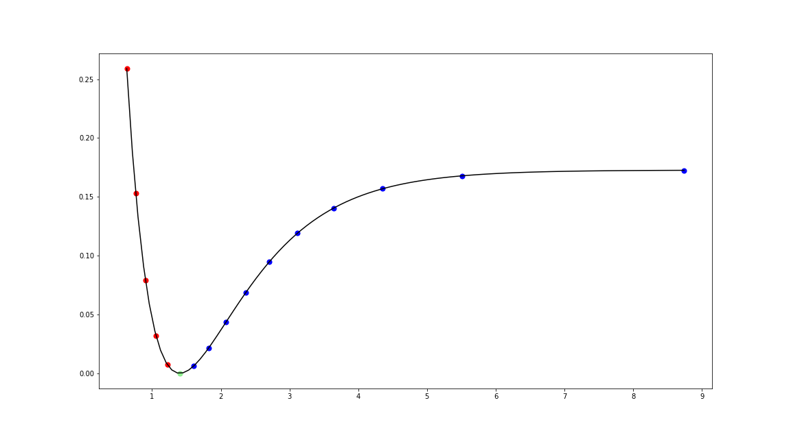

# SRBOgrid - Space-Reduced Bond Order Grid

This module calculates the Space-Reduced Bond Order grids for optimal
configuration space sampling of the potenial energy curves for diatomics.

The code is based on the work described in: Rampino, S. (2016). Configuration-Space Sampling in Potential Energy Surface Fitting: A Space-Reduced Bond-Order Grid Approach. The Journal of Physical Chemistry A, 120(27), 4683–4692. [doi: 10.1021/acs.jpca.5b10018](http://doi.org/10.1021/acs.jpca.5b10018)

## Getting Started

These instructions will give you a copy of the project up and running on
your local machine for development and testing purposes. See deployment
for notes on deploying the project on a live system.

### Installation

Best way to install `srbogrid` is with `pip`:

```bash
pip install srbogrid
```

### Example

```python
from srbogrid.srbo import SRBO
```

The most straightforward way to compute the grid is to provide the parameters

- `Re` :  eqilibrium bond distance in atomic units [bohr]
- `De` : dissociation energy in atomic units [hartree]
- `ke` : force constant in atomic units [hartree / bohr^2]

#### Hydrogen molecule

For hydrogen molecule we can compute a SRBO grid with the following values:

```python
h2 = SRBO(Re=1.4034, De=0.1727, ke=0.3707)
h2.grid
array([0.63152744, 0.7632642 , 0.90460173, 1.05705019, 1.2225067 ,
       1.4034    , 1.60290972, 1.82531189, 2.07654928, 2.36522877,
       2.70449828, 3.1159375 , 3.63878276, 4.35671283, 5.50882366,
       8.7400997 ])
```

By default the grid will contain:

- 5 points on the repulsive part of the potential energy curve (left from `Re`)
- 10 points on the attractive part of the potential energy curve (right from `Re`)
- `Re` point itself

You can get more information by printing the `summary`:

```python
print(h2.summary())

System info:
	Re        :   1.403400
	De        :   0.172700
	ke        :   0.370700
	alpha     :   1.035977

Boundaries:
	rmin      :   0.631527
	rmax      :   8.740100
	Vfact     :   1.500000
	Vthrs     :   0.001000

	Beta      :   0.515422

Grid:
	nrep      :          5
	natt      :         10
	npoints   :         16
	f         :   2.000000

Grid points:
[0.63152744 0.7632642  0.90460173 1.05705019 1.2225067  1.4034
 1.60290972 1.82531189 2.07654928 2.36522877 2.70449828 3.1159375
 3.63878276 4.35671283 5.50882366 8.7400997 ]
```

You can visualize the grid on a model Morse potential with:

```python
h2.plot_morse()
```

<p align="center">
    
</p>

### More examples

A short tutorial is available
[here](http://nbviewer.jupyter.org/github/lmmentel/srbogrid/blob/master/notebooks/tutorial.ipynb) as a jupyter notebook.

## License

This project is licensed under the [MIT](LICENSE.md)
License - see the [LICENSE.md](LICENSE.md) file for
details.
